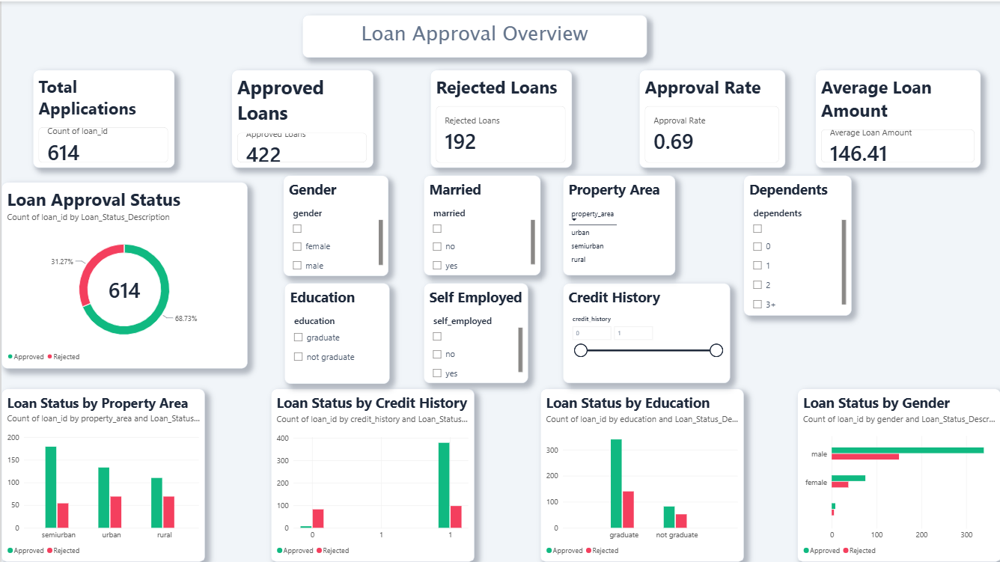
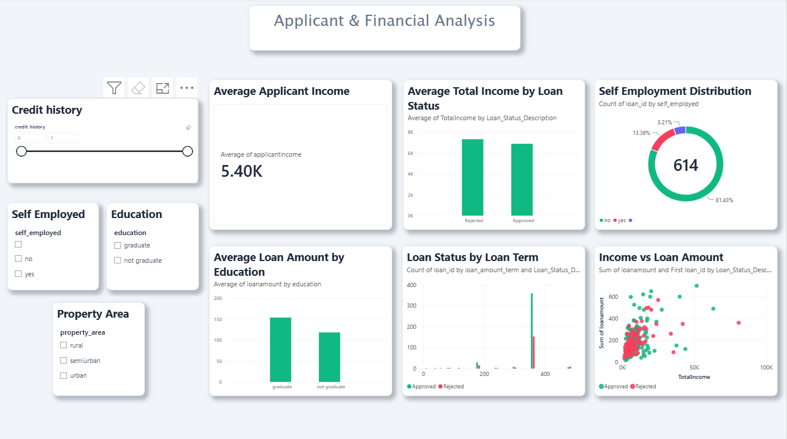
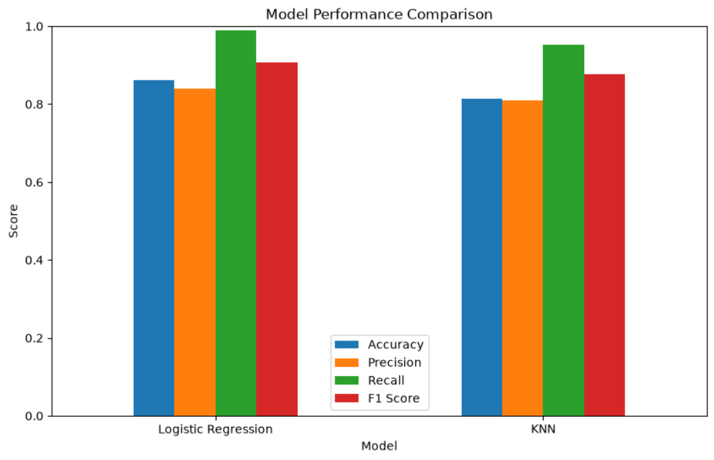
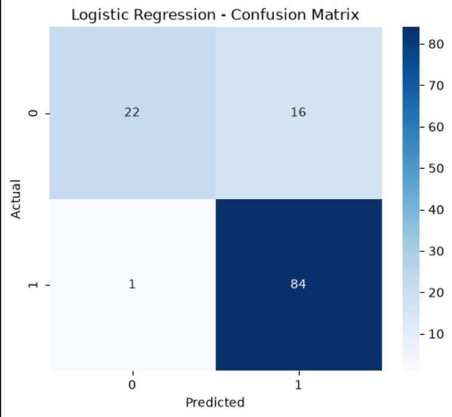

# 🏦 Loan Approval Prediction & Analysis

### Machine Learning + Power BI | Finance & Banking

A complete data science project that predicts **loan approval outcomes using Machine Learning** and analyzes applicant and loan data through an **interactive Power BI dashboard**.

---

## 📌 Project Overview

Loan approval decisions depend on multiple factors such as income, credit history, education, employment status, loan amount, and property area.

This project uses historical loan application data to:

- 🔍 Explore and clean loan application data
- 🤖 Build Machine Learning classification models
- 📊 Compare Logistic Regression and KNN
- 🎯 Predict loan approval for new applicants
- 📈 Analyze loan trends using Power BI
- 💡 Extract meaningful business insights from the data

**Domain:** Finance / Banking  
**Project Type:** Supervised Machine Learning — Binary Classification

---

## 🛠️ Technologies Used

| Technology | Purpose |
|---|---|
| 🐍 Python | Data processing & Machine Learning |
| 🐼 Pandas | Data manipulation |
| 🔢 NumPy | Numerical operations |
| 🤖 Scikit-learn | Machine Learning |
| 📊 Matplotlib | Data visualization |
| 📈 Seaborn | Statistical visualization |
| 📓 Jupyter Notebook | Model development |
| ⚡ Power BI | Interactive dashboard |
| 🔄 Power Query | Data transformation |
| 📐 DAX | Dashboard calculations |

---

## 📂 Dataset

The project uses the **Kaggle Loan Prediction dataset**.

### Dataset Information

- **614** loan application records
- **13** original columns
- Target variable: `loan_status`

### Target Variable

| Value | Meaning |
|---|---|
| `Y` | ✅ Loan Approved |
| `N` | ❌ Loan Rejected |

The original CSV dataset is **not included in this repository**.

See [`data/README.md`](data/README.md) for dataset documentation.

---

# 🤖 Machine Learning

## Workflow

```text
Raw Dataset
     ↓
Data Exploration
     ↓
Data Cleaning
     ↓
Missing Value Handling
     ↓
Categorical Encoding
     ↓
Feature Preparation
     ↓
Train-Test Split
     ↓
Model Training
     ↓
Model Evaluation
     ↓
Model Comparison
     ↓
New Applicant Prediction
```

---

## 🧠 Models Used

### 1. Logistic Regression

Logistic Regression was used to predict whether a loan application would be approved or rejected.

### 2. K-Nearest Neighbors (KNN)

KNN was implemented with:

**K = 5**

---

# 📊 Model Performance

| Model | Accuracy | Precision | Recall | F1 Score |
|---|---:|---:|---:|---:|
| 🥇 **Logistic Regression** | **86.18%** | 84.00% | **98.82%** | **90.81%** |
| KNN (K=5) | 81.30% | 81.00% | 95.29% | 87.57% |

### 🏆 Best Model

**Logistic Regression** achieved the best overall performance.

It achieved:

- **86.18% Accuracy**
- **84.00% Precision**
- **98.82% Recall**
- **90.81% F1 Score**

---

# 📈 Power BI Dashboard

The project includes a two-page interactive Power BI dashboard.

## Page 1 — Loan Approval Overview

The first page provides an overview of loan approval patterns.

### Key Metrics

- Total Applications
- Approved Loans
- Rejected Loans
- Approval Rate
- Average Loan Amount

### Visual Analysis

- Loan Approval Status
- Loan Status by Property Area
- Loan Status by Credit History
- Loan Status by Education
- Loan Status by Gender
- Interactive Slicers

### Dashboard Preview



---

## Page 2 — Applicant & Financial Analysis

The second page focuses on applicant characteristics and financial patterns.

### Analysis Includes

- Income vs Loan Amount
- Average Loan Amount by Education
- Average Total Income by Loan Status
- Loan Status by Loan Term
- Self-Employment Distribution
- Average Applicant Income
- Interactive Filters

### Dashboard Preview



---

# 📊 Machine Learning Visualizations

## Model Comparison



## Confusion Matrix — Logistic Regression



---

# 📁 Project Structure

```text
Loan_Approval_Project/
│
├── 📂 data/
│   └── README.md
│
├── 📂 powerbi/
│   └── Loan_Approval_Dashboard.pbix
│
├── 📂 presentation/
│   └── Loan_Approval_Presentation.pptx
│
├── 📂 screenshots/
│   ├── dashboard_page_1.png
│   ├── dashboard_page_2.png
│   ├── model_comparison.png
│   └── confusion_matrix.png
│
├── 📓 Loan_Approval_Project.ipynb
├── 📊 model_results.csv
├── 📄 requirements.txt
├── 📄 README.md
└── 📄 .gitignore
```

---

# 🚀 How to Run

### 1. Clone the repository

```bash
git clone https://github.com/GAtharva/loan-approval-prediction-ml.git
cd loan-approval-prediction-ml
```

### 2. Create a virtual environment

```bash
python -m venv loan_env
```

### 3. Activate the environment

**Windows PowerShell:**

```powershell
.\loan_env\Scripts\Activate.ps1
```

### 4. Install dependencies

```powershell
pip install -r requirements.txt
```

### 5. Launch Jupyter Notebook

```powershell
jupyter notebook
```

Open:

```text
Loan_Approval_Project.ipynb
```

---

# 💼 Business Insights

The analysis demonstrates how Machine Learning and Business Intelligence can work together in a financial decision-making scenario.

Key areas analyzed include:

- Credit history and loan approval
- Applicant income
- Co-applicant income
- Loan amount
- Education
- Employment status
- Property area
- Loan repayment term

The project demonstrates both **predictive analytics** and **business-oriented data visualization**.

---

# 🎯 Key Outcome

Among the two tested Machine Learning models:

> **Logistic Regression achieved the best overall performance with 86.18% accuracy and a 90.81% F1 score.**

The project combines:

**Data Science + Machine Learning + Business Intelligence**

to create an end-to-end loan approval analysis solution.

---

# 📦 Project Deliverables

| Deliverable | Included |
|---|---|
| Machine Learning Notebook | ✅ |
| Logistic Regression Model | ✅ |
| KNN Model | ✅ |
| Model Comparison | ✅ |
| Confusion Matrix | ✅ |
| Power BI Dashboard | ✅ |
| PowerPoint Presentation | ✅ |
| Dashboard Screenshots | ✅ |
| Dataset Documentation | ✅ |

---

# 👨‍💻 Author

### Atharva Gaikwad

**BSc Data Science & Business Analytics**

Interested in **Data Science, Machine Learning, Generative AI and Analytics**.

---

⭐ If you find this project useful, consider giving the repository a star!